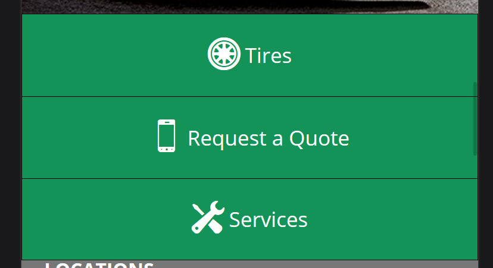
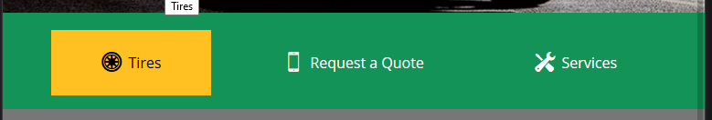

# Template 001
[Template 001](Template-001)
Output Mobile

Output Desktop


```html
<div class="ctas-container">
    <a href="#" class="cta cta-1" title="Tires">
        <div class="content"><i class="icon icon-tire-4"></i><span class="title">Tires</span></div>
    </a>
    <a href="#" class="cta cta-2" title="Request a Quote">
        <div class="content"><i class="icon icon-phone-3"></i><span class="title">Request a Quote</span></div>
    </a>
    <a href="#" class="cta cta-3" title="Services">
        <div class="content"><i class="icon icon-auto-services-5"></i><span class="title">Services</span></div>
    </a>
</div>
```
### Code SCSS
```scss
.ctas-container {
    @include tablet-desktop { display: flex; justify-content: space-between; padding: 2.54vw 0 2.02vw; }
    .cta {
        @include transition(background-color, color, 0.3s ease-in-out); display: flex; align-items: center; justify-content: center;
        border: 1px solid #000; width: 100%; height: 18vw; text-decoration: none; color: #fff;
        @include tablet-desktop { border: 0; width: 22.77vw; height: 9.36vw; }
        &:nth-child(-n+2) { @include phone { border-bottom: 0; } }
        .content {
            display: flex; align-items: center; font-size: responsive-px(16, 35, 320, 767);
            @include tablet-desktop { font-size: responsive-px(16, 28, 768, 1920); }
            .icon { margin-right: 1vw; font-size: responsive-px(16, 55, 320, 767); @include tablet-desktop { font-size: 2.8vw; } }
        }
        @include hover { background-color: $yellow; color: #000; }
    }
}
```