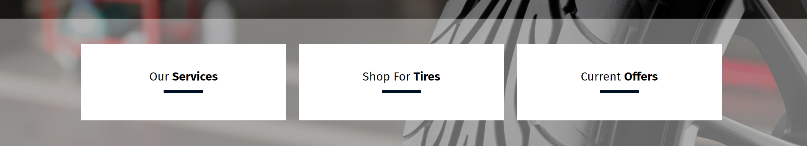

# Template 003 by Jorge Reyes
Output Mobile


Output Desktop



### Code HTML

```html
<div class="ctas-container container">
    <a class="cta cta-wheels" href="/Auto-Repair" title="Services">
        <span class="text-cta">
            Our
            <span class="boldsec">Services</span>
        </span>
    </a>
    <a class="cta cta-tires" href="/Shop-For-Tires" title="Tires">
        <span class="text-cta">
            Shop For
            <span class="boldsec">Tires</span>
        </span>
    </a>
    <a class="cta cta-specials" href="/Coupons" title="Coupons">
        <span class="text-cta">
            Current
            <span class="boldsec">Offers</span>
        </span>
    </a>
</div>
```

### Code SCSS

```scss
.ctas-container{
    display: flex; flex-direction: column; justify-content: center; align-items: center; font-family: $webfont; margin: 0; padding: 0;
    .cta{
        text-decoration: none; display: flex; justify-content: center; align-items: center; width: 100%; background-color: $primary-color;
        height: get-vw-mb(267); font-size: get-vw-mb(56); color: $third-color;
        .text-cta{
            position: relative; padding-bottom: get-vw-mb(50);
            &:before{
                content: ''; position: absolute; bottom: 0; left: 50%; transform: translateX(-50%); height: get-vw-mb(14);
                width: get-vw-mb(189); background-color: $secondary-color;
            }
            .boldsec{ font-weight: 700; }
        }
    }
    @media (min-width: 768px){ // SM
        flex-direction: row; justify-content: space-between; padding: get-vw-desktop(60) 0 !important; margin: 0 auto;
        .cta{
            transition: all 0.5s ease-in-out; background: $third-color; color: $fourth-color; width: 32%; height: get-vw-desktop(180);
            font-size: responsive-px(14, 28, 768, 1920);
            .text-cta{
                padding-bottom: get-vw-desktop(25);
                &:before{ transition: all 0.5s ease-in-out; height: get-vw-desktop(7); width: get-vw-desktop(92); background: $primary-color; }
            }
            &:hover{ background-color: $primary-color; color: #fff; .text-cta{ &:before{ background-color: $secondary-color; } } }
        }
    }
}
```