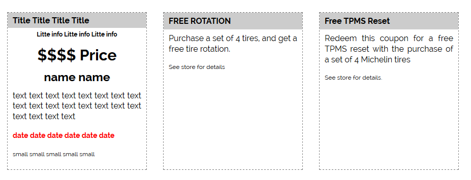
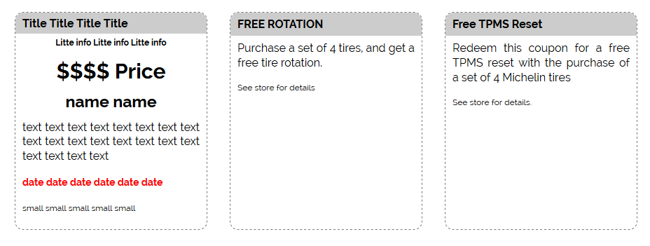

# Coupons
### Coupons
The basic structure of coupons is the next.

To achieve this you can use the next code.
#### HTML
```html
<div id="maincc" class="main-content-container">
    <div class="pc-header">
        <h2><span class="head">
                In Store Coupons
            </span></h2>
    </div>
    <div class="subcontainer coupon-container">
        <div class="coupon coupon-1">
            <h2 class="title"></h2>
            <p class="little-info"></p>
            <div class="info">
                <h3 class="price"></h3>
                <h4 class="name"></h4>
                <p class="text"></p>
                <p class="date"></p>
                <p class="small"></p>
            </div>
        </div>
    </div>
</div>
```
#### SCSS
```scss
.coupon-container {
    display: flex; flex-wrap: wrap; justify-content: center;
    .coupon {
        overflow: hidden; border: 1px dashed #777; /* border-radius: .75rem; */ margin: 0 1rem 2rem; width: 275px; min-height: 250px;
        .little-info { font-size: .75rem; text-align: center; margin: 0.6em 0 0; font-weight: 700; padding: 0 1rem; }
        .title { background-color: #ccc; padding: 7px 10px; margin: 0; @include tablet-desktop { font-size: 1rem; } }
        .info {
            padding: 7px 10px;
            .price { text-align: center; margin: 10px 0; font-size: 2rem; }
            .name {
                font-weight: 700; text-align: center; font-size: 1.5rem; line-height: 1.3; margin: 0 0 .5em;
                span { display: block; }
            }
            .text { font-size: 1rem; line-height: 1.3; }
            .date { font-size: .875rem; color: red; font-weight: 700; }
            .small { font-size: .75rem; }
        }
    }
}
```
### Coupons with border radius
The structure and styles are the same, just uncomment `border-radius: .75rem;` to achieve the next result.
