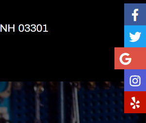
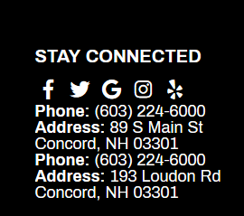

# Socials
By default only Facebook and Google links are in the HTML, so if you need any aditional social you have to create the tokens and add the HTML code where you need it. The recomendation is to replace all the code with the one provided.

### Styles
The next scss is for all page, so you need to add it only once for mobile, socialpane and footer.
By default all the socials are disabled, to enable just put true where you need it like this `$fb: true;`
```scss
body {
    $fb: false;
    $yelp: false;
    $google: false;
    $youtube: false;
    $twitter: false;
    $instagram: false;
    $mobile-menu-color: #000;
    #dnn_SocialPane { @include tablet-desktop { top: 45vh; } #socialfont { a { display: block; width: 45px; height: 45px; line-height: 45px; text-align: center; font-size: 25px; box-sizing: border-box; padding-right: 0; float: right; clear: both; color: #fff; transition: 0.2s linear; text-decoration: none; &[href=""] { display: none; } @include phone { float: unset; /* display: inline-block; */ display: none; } @include tablet-desktop { @include hover { padding-right: 20px; width: 65px; } } &.fa-yelp { background: #c41200; } &.fa-google { background: #de5246; } &.fa-twitter { background: #1da1f2; } &.fa-facebook { background: #3b5998; } &.fa-instagram { background: #515bd4; } &.fa-youtube { background: #c4302b; } } } } #top-social a { &.fa-yelp { color: #c41200; } &.fa-google { color: #de5246; } &.fa-twitter { color: #1da1f2; } &.fa-facebook { &, &-f { color: #3b5998; } } &.fa-instagram { color: #515bd4; } } #top-social a { &[class*="fa-"] { color: $mobile-menu-color; } } #bgbottom #netdriven #BottomFooter #socialfont { @include max(527) { float: unset; } a[class] { transition: background-color 0.3s, color 0.3s; display: inline-flex; justify-content: center; align-items: center; border-radius: 50%; width: 1.25em; height: 1.25em; padding: 5px; @include hoverall { text-decoration: none; color: #fff; &.fa-yelp { background: #c41200; } &.fa-google { background: #de5246; } &.fa-twitter { background: #1da1f2; } &.fa-facebook { background: #3b5998; } &.fa-instagram { background: #515bd4; } &.fa-youtube { background: #c4302b; } } } } @if not $fb { .fa-facebook { &, &-f { display: none !important; } } } @if not $yelp { .fa-yelp { display: none !important; } } @if not $google { .fa-google { display: none !important; } } @if not $twitter { .fa-twitter { display: none !important; } } @if not $instagram { .fa-instagram { display: none !important; } } @if not $youtube { .fa-youtube { display: none !important; } }
}
```
### Mobile menu
The code you need is
```html
<!-- Mobile Menu -->
<div id="top-social">
    <a href="[ND:Facebook]" target="_blank" class="fa fa-facebook"></a>
    <a href="[ND:Twitter]" target="_blank" class="fa fa-twitter"></a>
    <a href="[ND:Google]" target="_blank" class="fa fa-google"></a>
    <a href="[ND:Instagram]" target="_blank" class="fa fa-instagram"></a>
    <a href="[ND:Yelp]" target="_blank" class="fa fa-yelp"></a>
    <a href="[ND:Youtube]" target="_blank" class="fa fa-youtube"></a>
</div>
```
It will show like this.


### SocialPane
The code you need is
```html
<!-- SocialPane -->
<div id="socialfont" class="sidetab-social">
    <a class="fa fa-facebook" target="_blank" href="[ND:Facebook]"></a>
    <a class="fa fa-twitter" target="_blank" href="[ND:Twitter]"></a>
    <a class="fa fa-google" target="_blank" href="[ND:Google]"></a>
    <a class="fa fa-instagram" target="_blank" href="[ND:Instagram]"></a>
    <a class="fa fa-yelp" target="_blank" href="[ND:Yelp]"></a>
    <a class="fa fa-youtube" target="_blank" href="[ND:Youtube]"></a>
</div>
```
It will show like this.



### Footer
The code you need is
```html
<!-- Footer -->
<div id="socialfont">
    <a class="fa fa-facebook" target="_blank" href="[ND:Facebook]"></a>
    <a class="fa fa-twitter" target="_blank" href="[ND:Twitter]"></a>
    <a class="fa fa-google" target="_blank" href="[ND:Google]"></a>
    <a class="fa fa-instagram" target="_blank" href="[ND:Instagram]"></a>
    <a class="fa fa-yelp" target="_blank" href="[ND:Yelp]"></a>
    <a class="fa fa-youtube" target="_blank" href="[ND:Youtube]"></a>
</div>
```
It will show like this.



### Contributions
* Source code by Daniel Aguirre
* Added Youtube by Jorge Reyes
* Display none on empty SocialPane by Manuel Higuera